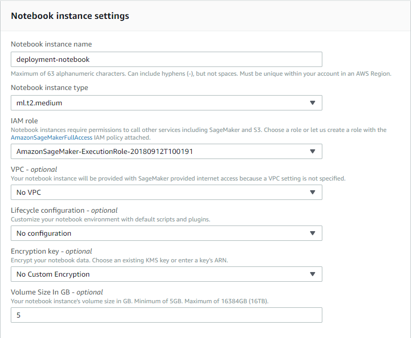
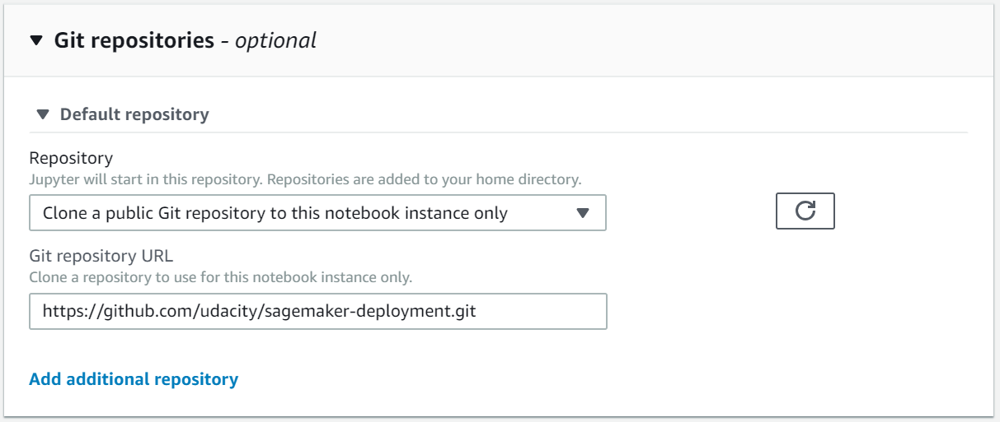
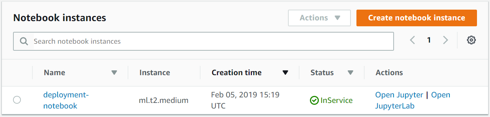

# Deployment-Project
Setting up a Notebook Instance
The deployment project which you will be working on is intended to be done using Amazon's SageMaker platform. In particular, it is assumed that you have a working notebook instance in which you can clone the deployment repository.

First, start by logging in to the AWS console, opening the SageMaker dashboard and clicking on Create notebook instance.

You may choose any name you would like for your notebook. A ml.t2.medium is used to launch the notebook and is available by default. Inside the notebook ml.p2.xlarge is used for training a model and ml.m4.xlarge is used for deployment. These instance may not be available to all users by default. If you haven't requested ml.p2.xlarge so far please follow the instructions on the next page to request it now.

Next, under IAM role select Create a new role. You should get a pop-up window that looks like the one below. The only change that needs to be made is to select None under S3 buckets you specify, as is shown in the image below.

Create an IAM role dialog box
Once you have finished setting up the role for your notebook, your notebook instance settings should look something like the image below.

Notebook instance settings
Note that your notebook name may be different than the one displayed and the IAM role that appears will be different.

Next, scroll down to the section labelled Git repositories. Here you will clone the https://github.com/udacity/sagemaker-deployment.git repository.

Once you have filled in all of the required values, the settings should look as so:

You're done! Click on Create notebook instance.

Your notebook instance is now set up and ready to be used!

Once the Notebook instance has loaded, you will see a screen resembling the following.

You can access your notebook using the Action "Open Jupyter".
